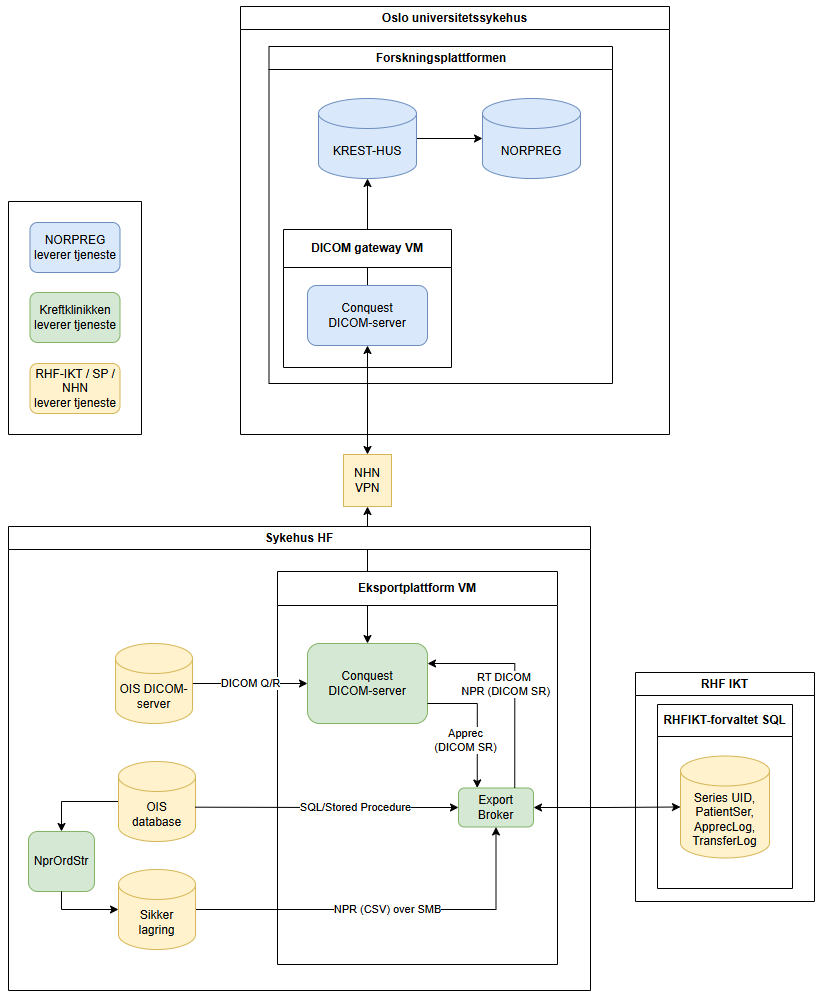

# Eksportplattform

Dette prosjektet automatiserer eksport av stråleterapi-relaterte DICOM-data fra **ARIA** til **Conquest PACS**, og videre til eksterne mottakere (KREST / NORPREG).

Scriptet finner behandlingsplaner opprettet etter en gitt dato, bygger en komplett DICOM-studiestruktur (RTPLAN → RTDOSE → RTSTRUCT → CT), overfører manglende objekter via Dicom Query / Retrieve fra Aria DCM til Conquest, og sender deretter studien videre til KREST-XXX / NORPREG.

En overordnet beskrivelse er gitt i figuren under:


# Formål

Systemet sikrer at:

* komplette stråleterapiplaner eksporteres
* alle nødvendige DICOM-objekter følger med
* eksporten kan spores og reproduseres (MSSQL).
* DICOM Apprec mottas via DICOM SR på pasientnivå og evt. feil logges i databasen (MSSQL). Se mer detaljer om hvordan disse lages i [NORPREG-repoet](github.com/NORPREG/NORPREG).
* Senere vil også NPR-rapporten hentes ut fra SMB og pakkes inn i DICOM SR. Per i dag sendes den separat over Filsluse.

---

# Oversikt

Arbeidsflyten er:

1. Hent alle RT plan-sett fra ARIA etter en gitt dato
2. For hver pasient:
   * Finn RT Plan og tilhørende RT Dose via ARIA DB integrasjon. En [Stored Procedure er laget for dette formålet](resources/blp_GetTxRecordsProtonToExport.sql).
   * Finn referert RT Structure Set fra RT Plan-filen
   * Finn CT-serier referert fra Structure Set
3. Last ned DICOM-objekter fra ARIA til lokal Conquest via C-MOVE. Dette gjøres i [Aria Dicom-grensesnittet](module/interfaces/aria_dicom_interface.py).
4. Send komplett datasett videre til:
   * Intern Conquest-node (denne var nødvendig for å sørge for to lyttende porter, anbefaler å sette opp intern port mot OIS som 314XX -- samme som mot KREST-XXX.
   * KREST-XXX
5. Logg eksporterte pasienter i en eksportdatabase (MSSQL). [Se LogDatabase-grensesnittet her](module/interfaces/export_logger_interface.py).

Dette sikrer at komplette behandlingsdatasett blir eksportert konsistent.

TODO: Legg til NPR i eksporten
TODO: RT Treatment Record eksport kræsjer pga. bug i Aria (når det er ° i FieldId...).

---

# Arkitektur

Scriptet fungerer som en **orkestrator** som koordinerer flere grensesnittmoduler:

```
ARIA Database
      │
      ▼
aria_db_interface
      │
      ▼
PlanSet struktur
      │
      ▼
ARIA DICOM (C-MOVE)
aria_dicom_interface
      │
      ▼
Conquest PACS
      │
      ├─ conquest_db_interface
      │
      └─ conquest_dicom_interface
             │
             ▼
      Eksterne mottakere
      (NORPREG / KREST)
```

---

# Datastruktur

`plan_set` representerer behandlingsdata organisert per pasient:

```
PatientSer {
    "PatientID",
    "PlanSet": {
        RT Plan SOP UID: {
            "RTPLAN": RT Plan SOP UID,
            "RTPlanLabel": "...",
            "RTDOSE": {Dose SOP UID},
            "RTSTRUCT": {Structure SOP UID},
            "RTRECORD": [Treatment Record UID],
            "CT": {Series Instance UID}
        }
    }
}
```

Denne strukturen bygges opp gradvis mens scriptet finner refererte objekter.

---

# Arbeidsflyt

## 1. Finn plan-sett

```python
plan_set = aria_db_interface.get_plan_set(dt)
```

Returnerer alle pasienter med RT Plan opprettet etter en gitt dato.

---

## 2. Kontroller om pasienten allerede er eksportert

Eksportdatabasen brukes til å unngå duplikater.

```python
sent_dt = log_database.check_patient(patient_ser)
```

---

## 3. Verifiser RTPLAN og RTDOSE

Scriptet sjekker om disse finnes i Conquest.

Hvis ikke:

```
ARIA → C-MOVE → Conquest
```

---

## 4. Finn RTSTRUCT

Fra RT Plan-filen hentes referert Structure Set.

Hvis mangler:

```
ARIA → C-MOVE → Conquest
```

---

## 5. Finn CT-serie

Fra RTSTRUCT identifiseres refererte CT-serier.

Hvis serien ikke finnes i Conquest:

```
ARIA → C-MOVE → Conquest
```

---

## 6. Send komplett studie

Når alle nødvendige objekter finnes:

```
Conquest (Medfys-1) → Conquest (Medfys-2)
Conquest (Medfys-2) → KREST-HUS
```

Merk at det her benyttes to Conquest-instanser. Det er fordi ulike port-rekkevidder måtte benyttes mot Aria (via "medfys-1") og KREST-HUS (via "medfys-2").
Derfor må dataene først flyttes fra "medfys-1" til "medfys-2" før de kan overføres til KREST-HUS, da via en C-MOVE.
# TODO: Ved en senere endring i Aria DCM-tjenesten kan Conquest-noden rekonfigureres så den snakker med både Aria og KREST.

Dette gjøres via:

```python
conquest_dicom_interface.c_move_to_medfys2(...)
conquest_dicom_interface.c_move_to_krest_hus(...)
```

---

# Konfigurasjon

Konfigurasjon lastes fra `Config`, som funker som en Singleton med dot-henvisning:

```python
from config import Config
config = Config()
```

Se `config/config_test.toml` for eksempel.

Merk: Produksjonskonfigurasjon leses fra stien definert i `module/config.py` (standard: `D:/Config/eksportplattform.toml`).

---

# Viktige moduler

## Interfaces

| Modul                    | Beskrivelse                      |
| ------------------------ | -------------------------------- |
| aria_db_interface        | Leser RT Plan-data fra ARIA SQL  |
| aria_dicom_interface     | DICOM kommunikasjon mot ARIA     |
| conquest_db_interface    | Query mot Conquest database      |
| conquest_dicom_interface | DICOM eksport fra Conquest       |
| export_logger_interface  | Logging av eksporterte pasienter |

---

# Kjøring

Scriptet kan kjøres direkte:

```
python eksportplattform.py
```

Programmet er hardkodet til å søke etter pasienter fra 2026-01-01, dette kan naturligvis endres ved behov eller settes som program-argument.
Denne settes så opp i Windows Task Scheduler til å kjøre hver kveld.

# Avhengigheter

Installer med:

```
pip install -r requirements.txt
```

Hovedavhengigheter:

| Pakke      | Brukes til                          |
| ---------- | ----------------------------------- |
| sqlmodel   | ORM mot eksportdatabase og Conquest |
| sqlalchemy | Database-engine og MSSQL-dialekt    |
| pyodbc     | MSSQL-driver                        |
| pydicom    | Lesing av DICOM-filer               |
| pydantic   | Datavalidering (ARIA-modeller)      |
| numpy      | NPR-databehandling                  |

I tillegg kreves Python ≥ 3.11 (for `tomllib`).
